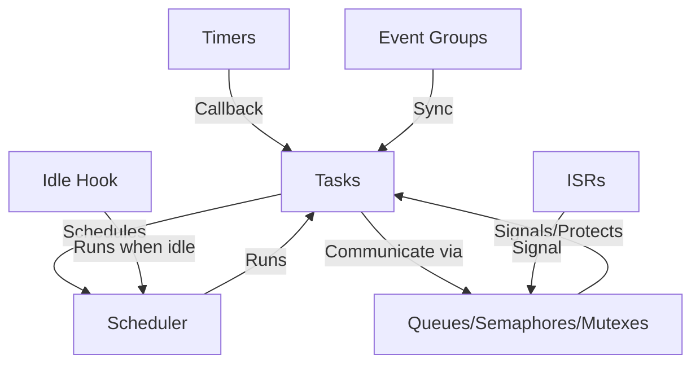

# ESP-IDF FreeRTOS Educational Demo Project

This project is a comprehensive learning resource for FreeRTOS on ESP32/ESP-IDF. It contains practical, well-commented examples for a wide range of FreeRTOS APIs and concepts, from beginner to advanced. Each demo is in its own file and can be run independently for focused learning.

---

## **FreeRTOS Architecture Overview**



- **Tasks:** Independent threads of execution.
- **Scheduler:** Decides which task runs next.
- **Queues/Semaphores/Mutexes:** For communication and synchronization.
- **ISRs:** Interrupt Service Routines, can signal tasks.
- **Timers:** Run code at intervals or after delays.
- **Event Groups:** Synchronize multiple tasks on events.
- **Idle Hook:** Runs when no other tasks are ready.

---

## **How to Use This Project**

1. **Select a Demo**
   - Open `main/blink_example_main.c`.
   - Uncomment **one** of the `#define RUN_FREERTOS_..._DEMO` lines to choose which demo to run. Only one should be active at a time.

2. **Build and Flash**
   - Use ESP-IDF commands:
     ```sh
     idf.py build
     idf.py -p (PORT) flash monitor
     ```
   - Replace `(PORT)` with your serial port (e.g., `/dev/ttyUSB0` or `COM3`).

3. **Observe Output**
   - Open the serial monitor to see log messages and interact with the board.

---

## **Demo Modules and FreeRTOS APIs Explained**

### 1. **Basic FreeRTOS Demo** (`freertos_basic.c/h`)
- **What:** Shows how to create and run multiple FreeRTOS tasks.
- **Why:** Learn task creation, scheduling, and basic multitasking.
- **When:** Use for simple multitasking (e.g., blinking LEDs, periodic actions).
- **Example:** Two tasks blink the same LED at different rates, demonstrating task switching.

### 2. **Intermediate FreeRTOS Demo** (`freertos_intermediate.c/h`)
- **What:** Demonstrates inter-task communication using a queue and ISR.
- **Why:** Safely communicate between an interrupt (button press) and a task.
- **When:** Use when you need to signal a task from an ISR (e.g., button, sensor).
- **Example:** Pressing the BOOT button toggles the LED using a queue.

### 3. **Advanced FreeRTOS Demo** (`freertos_advanced.c/h`)
- **What:** Shows software timers and event groups for advanced synchronization.
- **Why:** Timers allow periodic actions without blocking tasks; event groups synchronize multiple tasks.
- **When:** Use timers for periodic/delayed actions, event groups for multi-task sync.
- **Example:** A timer toggles the LED every second; two tasks wait for the event.

### 4. **Mutex Demo** (`freertos_mutex.c/h`)
- **What:** Mutexes protect shared resources from concurrent access.
- **Why:** Prevents data corruption and race conditions.
- **When:** Use when multiple tasks share a resource (e.g., UART, I2C, SPI).
- **Example:** Two tasks print to UART, using a mutex to avoid mixed output.

### 5. **Recursive Mutex Demo** (`freertos_recursive_mutex.c/h`)
- **What:** Recursive mutexes allow the same task to lock a mutex multiple times.
- **Why:** Useful for nested function calls that need the same lock.
- **When:** Use when a task may need to lock the same resource multiple times in a call chain.
- **Example:** A task locks a recursive mutex in nested functions; another task waits for it.

### 6. **Semaphore Demo** (`freertos_semaphore.c/h`)
- **What:** Semaphores are for signaling (binary) and managing resource pools (counting).
- **Why:** Synchronize tasks or limit access to multiple resources.
- **When:** Use binary semaphores for signaling (e.g., ISR to task), counting for resource pools.
- **Example:** A simulated ISR gives a binary semaphore; a task waits for it. Another task uses a counting semaphore for a pool of resources.

### 7. **Queue Set Demo** (`freertos_queue_set.c/h`)
- **What:** Queue sets let a task wait on multiple queues/semaphores at once.
- **Why:** Efficient for event-driven tasks with multiple sources.
- **When:** Use when a task must wait for messages from several sources.
- **Example:** Two queues send events; one task waits on the set and handles whichever is ready.

### 8. **Stream Buffer Demo** (`freertos_stream_buffer.c/h`)
- **What:** Stream buffers send/receive streams of bytes (not discrete messages).
- **Why:** Useful for UART, audio, or any streaming data.
- **When:** Use for variable-length data transfer between tasks or ISRs.
- **Example:** One task sends strings, another receives and prints them.

### 9. **Message Buffer Demo** (`freertos_message_buffer.c/h`)
- **What:** Message buffers send/receive discrete messages of variable length.
- **Why:** Useful for command passing, packets, or message-based protocols.
- **When:** Use for discrete messages between tasks or ISRs.
- **Example:** One task sends messages, another receives and prints them.

### 10. **Task Notification Demo** (`freertos_task_notify.c/h`)
- **What:** Direct-to-task notifications are fast, lightweight signals built into every task.
- **Why:** Fastest way to signal a task from another task or ISR.
- **When:** Use for simple signaling or counting events between tasks/ISRs.
- **Example:** One task notifies another, which counts and prints notifications.

### 11. **Priority Inheritance Demo** (`freertos_priority_inheritance.c/h`)
- **What:** Priority inheritance boosts the priority of a low-priority task holding a mutex needed by a higher-priority task.
- **Why:** Prevents 'priority inversion' where a high-priority task is blocked by a low-priority one.
- **When:** Use when sharing resources between tasks of different priorities.
- **Example:** Low, medium, and high priority tasks share a mutex; priority inheritance prevents inversion.

### 12. **Dynamic Task Demo** (`freertos_dynamic_task.c/h`)
- **What:** Tasks can be created and deleted dynamically at runtime.
- **Why:** Useful for temporary/background work, or to save memory.
- **When:** Use when a task is only needed for a short time or on demand.
- **Example:** One task creates another, which runs and deletes itself.

### 13. **Idle Hook Demo** (`freertos_idle_hook.c/h`)
- **What:** The idle hook is a function called by the FreeRTOS idle task when no other tasks are runnable.
- **Why:** Useful for background cleanup, power management, or statistics.
- **When:** Use for lowest-priority, non-time-critical work.
- **Example:** Prints a message from the idle hook; runs automatically when system is idle.

---

## **Troubleshooting Tips**

- **Build errors about missing includes or undefined references:**
  - Make sure you have uncommented only one `#define RUN_FREERTOS_..._DEMO` in `blink_example_main.c`.
  - Ensure all source and header files are present in the `main/` directory.
  - Run `idf.py fullclean` if you see strange build errors.

- **Serial monitor shows no output:**
  - Check your serial port and cable.
  - Make sure the correct port is specified in `idf.py -p (PORT) flash monitor`.
  - Try resetting the board.

- **LED does not blink or respond:**
  - Double-check the GPIO number in `menuconfig` or `sdkconfig`.
  - Make sure the board's LED is connected to the correct pin.
  - For button demos, ensure you are pressing the correct button (usually BOOT/GPIO0).

- **Demo seems to hang or crash:**
  - Check for stack overflow (increase task stack size if needed).
  - Use `idf.py monitor` to check for panic or error messages.

- **Idle hook demo does not print:**
  - Make sure `configUSE_IDLE_HOOK` is enabled in `menuconfig` under FreeRTOS settings.

---

## **FAQ (Frequently Asked Questions)**

**Q: Can I run more than one demo at a time?**
A: No, only one demo should be active at a time. Uncomment only one `#define RUN_FREERTOS_..._DEMO` in `blink_example_main.c`.

**Q: How do I change the LED or button GPIO?**
A: Use `idf.py menuconfig` and look for the "Example Configuration" or edit `sdkconfig` directly for `CONFIG_BLINK_GPIO`.

**Q: How do I add my own task or demo?**
A: Use the provided demos as templates. Create a new `.c/.h` file, add your function, and update `blink_example_main.c` and `CMakeLists.txt`.

**Q: What if I get a stack overflow or memory error?**
A: Increase the stack size for your tasks (the 2048 in `xTaskCreate`). Monitor memory usage with ESP-IDF tools.

**Q: Where can I learn more about FreeRTOS?**
A: See the links in the Learning Resources section below.

**Q: Can I use these demos on other ESP chips?**
A: Yes! Just set the correct target with `idf.py set-target <chip_name>` and check pin assignments.

---

## **Customization and Experimentation**
- Change the LED GPIO in `menuconfig` or by editing `sdkconfig`/`CONFIG_BLINK_GPIO`.
- Try modifying task priorities, stack sizes, or add your own tasks and synchronization!
- All code is heavily commented for clarity—read the source files for in-depth explanations.

---

## **Learning Resources**
- [ESP-IDF FreeRTOS Docs](https://docs.espressif.com/projects/esp-idf/en/latest/esp32/api-reference/system/freertos.html)
- [FreeRTOS Official Site](https://www.freertos.org/)
- [ESP-IDF Programming Guide](https://docs.espressif.com/projects/esp-idf/en/latest/esp32/)

---

**Happy Learning!**

This project is designed for students and educators to explore and understand FreeRTOS on real hardware. If you have questions or want to extend the demos, feel free to experiment and explore!
